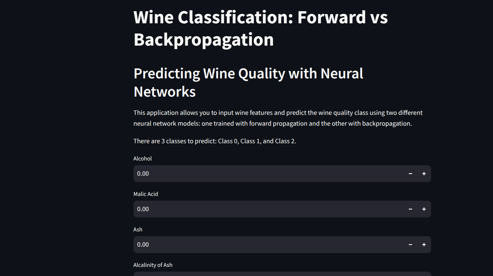
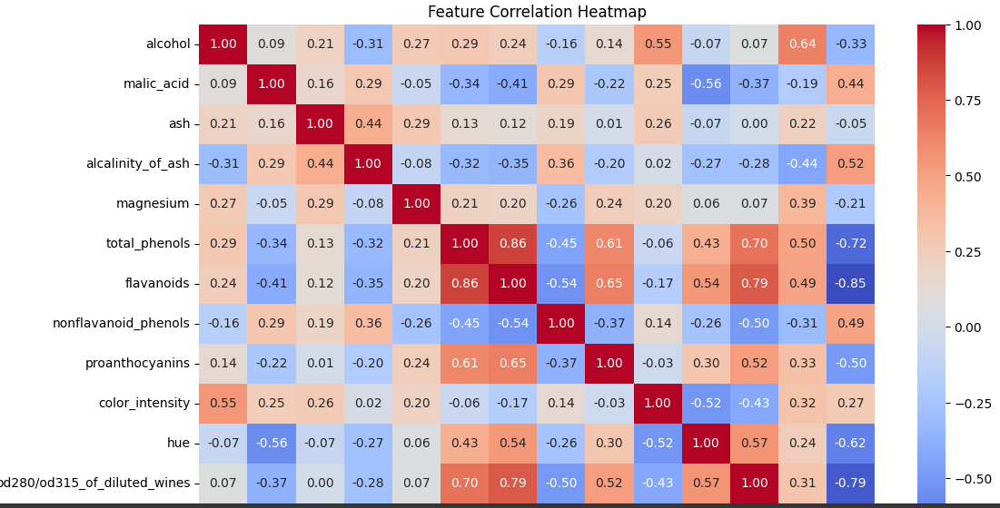
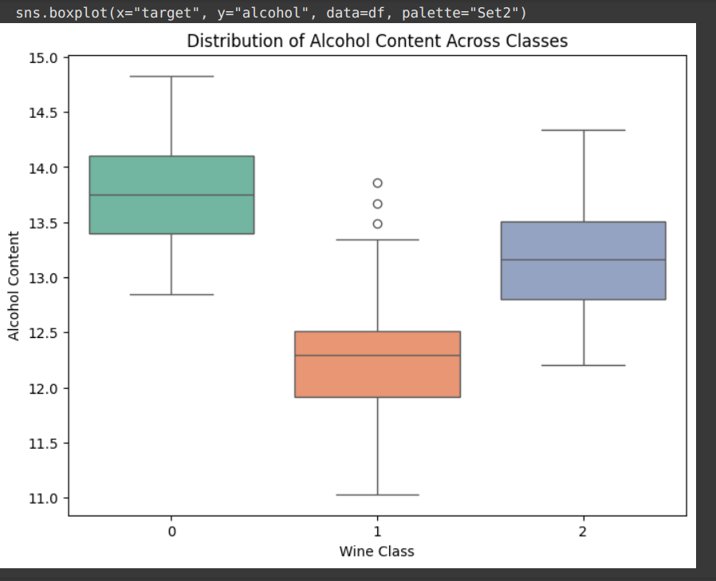

# Wine Prediction

## Introduction

This repository contains an  analysis of a classification problem using a network with out **backpropagation** and then using **backpropagation**. Different analysis metrics are used to evaluate the performance of the network. The dataset used is the **wine dataset** from the UCI Machine Learning Repository.

A simple user interface is also built for the user to input the wine features and get the prediction of the wine class using streamlit.



## File Structure

- `app.py`: The main file that contains the streamlit code for the user interface.
- `onlyforward.py`: The file that contains the code for the neural network without backpropagation.
- `withbackwardprop.py`: The file that contains the code for the neural network with backpropagation.
- `exploredata.py`: The file that contains the code for exploring the wine dataset.


## How to run

- Install stramlit using `pip install streamlit`

- Run the command `streamlit run app.py` in the terminal

- The app will open in the browser and you can input the wine features to get the prediction using both **onlyforward** and **withbackwardprop** models.


## About the Dataset

The Wine dataset is a well-known dataset used for classification tasks. It consists of **178 samples** of wine, each described by **13 numerical** features that capture various chemical properties such as alcohol content, malic acid, flavonoids, color intensity, and proline levels. These features help distinguish between three different classes of wine, labeled as 0, 1, and 2, which correspond to different cultivars (varieties) of wine grown in the same region of Italy. The dataset is commonly used for benchmarking machine learning algorithms due to its well-structured and moderately sized nature.

The code that describes the dataset is found in `exploredata.py`.

Some stats are also described here

```
Class Distribution:
target
1    71
0    59
2    48
```

### Correlation Matix 


### Distribution of alchol content across the three classes 



## About the models

Two models are used in this analysis. The first model is a simple neural network with no backpropagation. The second model is a neural network with backpropagation. The models are trained on the wine dataset and evaluated using various metrics such as accuracy, precision, recall, and F1 score. The code that describes the models is found in `onlyforward.py` and `withbackwardprop.py`.

Both model Arcitecture are the same with 13 input nodes, 5 hidden nodes, and 3 output nodes. The activation function  are **relu** then **softmax** for multiclass classification.

### accuracy of the models
```
without backpropagation:  66.67%
with backpropagation: 94.44%
```